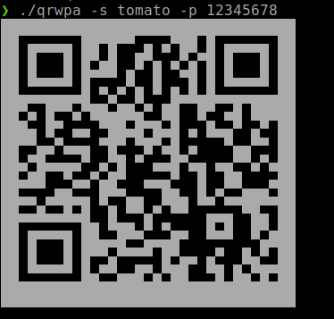

# qrwpa

Added a simple WiFi QR Code generator that uses bjguillot's qr implementation.

# qr
Simple QR Code Generator written in C without any third-party library dependencies.

I wanted to learn more about QR codes and figure out how to generate them from scratch.
From scratch meaning, without having to use any third party libraries.  Not even a PNG graphics library.
I decided to use C for the language to be as bare-bones as possible so that I would later be able
to easily code it in assembly language on retrocomputers.

To simplify the project, several limitations are in place:
  1.  Hard-coded to use Quality Mode “Q” (QR has Low, Medium, “Q”, and High Error Correction, Q is the 2nd best).  Felt “Q” (“Medium-High”) was the best compromise.
  2.  Hard-coded to use encoding scheme for 8-bit byte data (QR has numeric-only, alphanumeric-only, Byte, and Kanji).  Felt Byte was the most useful.
  3.  Hard-coded to use Mask 1 (the bits of every even row are flipped).  This is probably a bad thing and is against the QR specification.  You are supposed to try each of the 8 available mask types, calculate a $

Miscellaneous Notes:
  1. Maximum message size using 8-bit Byte encoding with Version 40-Q is 1,663 bytes.
  2. Message size after Reed-Solomon error correction for a 40-Q message is 3,706 bytes.
  3. Smallest QR Code (“Version 1”) is 21x21 pixels.
  4. Largest QR Code (“Version 40”) is 177x177 pixels.
  5. The program, as it is, simply runs several test cases, generating a png for each QR code version (V1, V2, up to V40).
  6. The first two calls to parseMessage() actually check results against a hard-coded test vector in the code to verify correctness.  The others can be verified by displaying the resulting PNG file and scanning it with a QR code reader app.

The two Android apps I used for testing:
  1. QR Scanner from Kaspersky Lab (version 1.1.0.228).
  2. QR Droid (version 6.6)
In general, QR Droid’s default scanning engine (“Zapper”), seemed to be able to scan the generated QR codes faster than QR Scanner;
however, above QR Version 20, the Zapper engine seemed to be unable to capture data, and I had to switch over to the alternate “ZXing” engine that isn’t quite as fast.

Learned how to build QR codes by following the very detailed Thonky.com Tutorial
http://www.thonky.co...-code-tutorial/

Compiled and tested on Mac OS X El Capitan 10.11.5.
